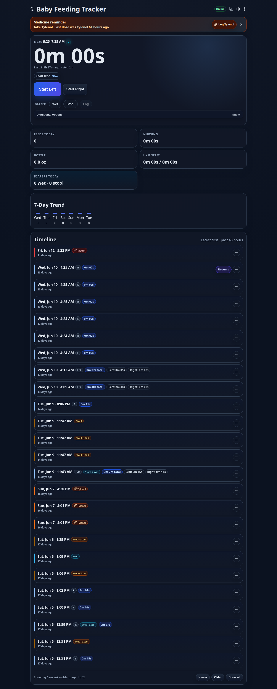

# Baby Feeding Tracker

> A tiny, production-ready care tracker built for one-handed, low-light newborn feeding workflows.



## Why it exists

Baby care tracking should be fast at 3 AM, reliable when Wi-Fi is flaky, and simple enough that two tired parents can trust it. This app focuses on the moments that matter: start a feed, switch sides, add bottle/diaper/medicine context, and move on.

## Highlights

| Feature | What it gives you |
|---|---|
| **One-tap feeding** | Start left/right nursing sessions with live timers and resume support. |
| **Mixed care timeline** | Nursing, bottle, diaper, missed feeds, and medicine events in one scan-friendly feed. |
| **Smart reminders** | Feeding windows plus independent Tylenol/Motrin six-hour reminder schedules. |
| **Offline-first UX** | Browser storage keeps tracking usable when the server is unavailable, then syncs back. |
| **SQLite durability** | Simple single-file persistence with backup, restore, and event replay tooling. |
| **Docker deploy** | Runs cleanly as a small private LAN service with health checks and mounted data. |

## Quick start

```bash
git clone <repo-url> baby-feeding-tracker
cd baby-feeding-tracker
npm ci
npm run build
npm test
```

Run locally:

```bash
npm run dev
```

Production Docker:

```bash
mkdir -p data backups logs
docker compose up -d --build
curl http://localhost:8080/api/health
```

Open `http://localhost:8080`.

## Configuration

Secrets stay local. Copy the examples and fill in real values only on the machine that runs the app:

```bash
cp .env.gotify.example .env.gotify
cp .env.smtp.example .env.smtp
```

The real `.env.*`, SQLite data, logs, backups, `node_modules`, and build output are ignored by git.

## Data & backups

| Path | Purpose |
|---|---|
| `data/feeding-tracker.db` | Runtime SQLite database. |
| `backups/*.db` | Portable backup files. |
| `logs/feeding-tracker-events.jsonl` | Reconstructable state event log. |

Create a portable backup:

```bash
npm run backup:db
```

Restore while the app is stopped:

```bash
docker compose down
npm run restore:db -- backups/feeding-tracker-YYYYMMDD-HHMMSS.db
docker compose up -d
```

Full production runbook: [`docs/PRODUCTION.md`](docs/PRODUCTION.md).

## Quality bar

Current validation suite:

```bash
npm run lint
npm run build
npm test
```

Coverage includes UI flows, sync behavior, stale-write merging, notification scheduling, backup/restore, event replay, and server route modules.

## Security note

Designed for trusted private/LAN deployment. Put it behind an auth proxy before exposing it to the public internet.
